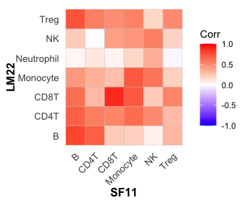
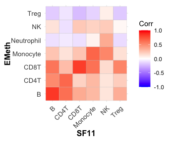
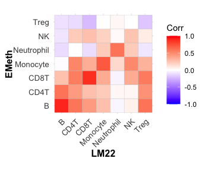
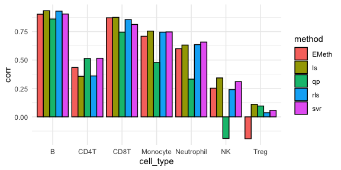
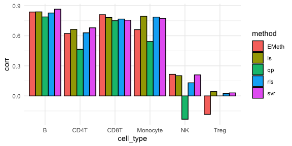
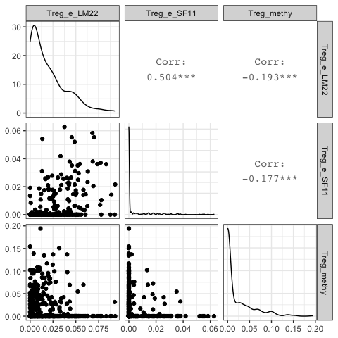
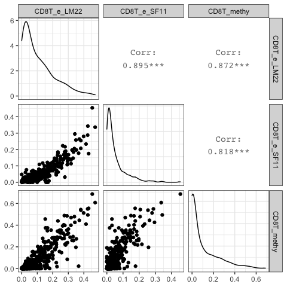

## Load required library

```r
library(data.table)
library(stringr)
library(MASS)

library(ggplot2)
library(gridExtra)
library(cowplot)
library(ggcorrplot)
library(GGally)
library(ggpubr)
theme_set(theme_bw())

library(tidyr)
```

## read in cell type proportion estimates

Read in cell type proportion estimates by EMeth using methylaiton data and the estimates by CIBERSORT, using two references: one was LM22, the default signature of CIBERSORT, and the other one was 11 cell types generated using scRNA-seq ata from SF2018


```r
load("TCGA_results/deconv_methy_SKCM.RData")
ls()
```

```
## [1] "rho"
```

```r
rho_methy = rho

load("TCGA_results/deconv_expr_SKCM.RData")
ls()
```

```
## [1] "deconv_expr" "rho"         "rho_methy"
```

```r
rho_LM22 = deconv_expr

dim(rho_methy)
```

```
## [1] 393   7   5
```

```r
rho_methy[1,,]
```

```
##                 EMeth        svr         ls        rls            qp
## CD4T       0.11515009 0.08088028 0.00000000 0.01057198  3.975715e-01
## CD8T       0.15297559 0.14354457 0.22097295 0.23091741 -4.259910e-18
## Monocyte   0.11397669 0.14909764 0.14899821 0.15344431  0.000000e+00
## B          0.19102648 0.17767818 0.14970741 0.17201533  1.674189e-01
## NK         0.03986908 0.04124818 0.04916470 0.02787493  1.356354e-18
## Neutrophil 0.05700207 0.02320019 0.02667351 0.02222075  3.204097e-17
## Treg       0.00000000 0.05435095 0.07448323 0.05295529  1.050096e-01
```

```r
dim(rho_LM22)
```

```
## [1] 393   7
```

```r
rho_LM22[1:2,]
```

```
##            CD4T      CD8T   Monocyte         B         NK  Neutrophil
## A8GB 0.13562180 0.1963459 0.06549970 0.1334766 0.06024759 0.005252743
## A8ZN 0.05153736 0.2231810 0.09616168 0.0271029 0.04327248 0.000000000
##            Treg
## A8GB 0.07355564
## A8ZN 0.04874455
```

```r
table(rownames(rho_LM22) == dimnames(rho_methy)[[1]])
```

```
## 
## TRUE 
##  393
```

```r
fnm = "CIBERSORTx_SKCM_SF2018_signature_Adjusted.txt"
rho_SF11 = as.data.frame(fread(paste0("_cibersortx_results/", fnm)))
dim(rho_SF11)
```

```
## [1] 471  15
```

```r
rho_SF11[1:2,]
```

<div data-pagedtable="false">
  <script data-pagedtable-source type="application/json">
{"columns":[{"label":[""],"name":["_rn_"],"type":[""],"align":["left"]},{"label":["Mixture"],"name":[1],"type":["chr"],"align":["left"]},{"label":["B_cells"],"name":[2],"type":["dbl"],"align":["right"]},{"label":["CD4T_memory"],"name":[3],"type":["dbl"],"align":["right"]},{"label":["CD8T_B"],"name":[4],"type":["dbl"],"align":["right"]},{"label":["CD8T_G"],"name":[5],"type":["dbl"],"align":["right"]},{"label":["Dendritic_cells"],"name":[6],"type":["dbl"],"align":["right"]},{"label":["Monocytes_Macrophages"],"name":[7],"type":["dbl"],"align":["right"]},{"label":["NK1"],"name":[8],"type":["dbl"],"align":["right"]},{"label":["NK2"],"name":[9],"type":["dbl"],"align":["right"]},{"label":["NK3"],"name":[10],"type":["dbl"],"align":["right"]},{"label":["Plasma_cells"],"name":[11],"type":["dbl"],"align":["right"]},{"label":["Tregs"],"name":[12],"type":["dbl"],"align":["right"]},{"label":["P-value"],"name":[13],"type":["int"],"align":["right"]},{"label":["Correlation"],"name":[14],"type":["dbl"],"align":["right"]},{"label":["RMSE"],"name":[15],"type":["dbl"],"align":["right"]}],"data":[{"1":"TCGA.D3.A8GB.06A","2":"0.08102024","3":"0.052347","4":"0.1799895","5":"0","6":"0.02675891","7":"0.08634692","8":"0.02556433","9":"0.1069697","10":"0","11":"0.3870558","12":"0.05394762","13":"0","14":"0.6090035","15":"0.795155","_rn_":"1"},{"1":"TCGA.WE.A8ZN.06A","2":"0.00000000","3":"0.000000","4":"0.1512271","5":"0","6":"0.03310032","7":"0.12485869","8":"0.27062465","9":"0.1424730","10":"0","11":"0.2337579","12":"0.04395848","13":"0","14":"0.1701766","15":"1.041354","_rn_":"2"}],"options":{"columns":{"min":{},"max":[10]},"rows":{"min":[10],"max":[10]},"pages":{}}}
  </script>
</div>

```r
rho_SF11$patient_id = substr(rho_SF11$Mixture, 9, 12)
```

## read in tumor purity information

```r
dir0 = "TCGA_results/clinical_data/"
fnm  = paste0(dir0, "TCGA_mastercalls.abs_tables_JSedit.fixed.txt")
tcga_purity = fread(fnm)

dim(tcga_purity)
```

```
## [1] 10786    10
```

```r
tcga_purity[1:2,]
```

<div data-pagedtable="false">
  <script data-pagedtable-source type="application/json">
{"columns":[{"label":["array"],"name":[1],"type":["chr"],"align":["left"]},{"label":["sample"],"name":[2],"type":["chr"],"align":["left"]},{"label":["call status"],"name":[3],"type":["chr"],"align":["left"]},{"label":["purity"],"name":[4],"type":["dbl"],"align":["right"]},{"label":["ploidy"],"name":[5],"type":["dbl"],"align":["right"]},{"label":["Genome doublings"],"name":[6],"type":["dbl"],"align":["right"]},{"label":["Coverage for 80% power"],"name":[7],"type":["dbl"],"align":["right"]},{"label":["Cancer DNA fraction"],"name":[8],"type":["dbl"],"align":["right"]},{"label":["Subclonal genome fraction"],"name":[9],"type":["dbl"],"align":["right"]},{"label":["solution"],"name":[10],"type":["chr"],"align":["left"]}],"data":[{"1":"TCGA-OR-A5J1-01","2":"TCGA-OR-A5J1-01A-11D-A29H-01","3":"called","4":"0.90","5":"2.0","6":"0","7":"9","8":"0.90","9":"0.02","10":"new"},{"1":"TCGA-OR-A5J2-01","2":"TCGA-OR-A5J2-01A-11D-A29H-01","3":"called","4":"0.89","5":"1.3","6":"0","7":"6","8":"0.84","9":"0.16","10":"new"}],"options":{"columns":{"min":{},"max":[10]},"rows":{"min":[10],"max":[10]},"pages":{}}}
  </script>
</div>

```r
rho_SF11$array = substr(rho_SF11$Mixture, 1, 15)
rho_SF11$array = gsub(".", "-", rho_SF11$array, fixed=TRUE)
dim(rho_SF11)
```

```
## [1] 471  17
```

```r
rho_SF11[1:2,(ncol(rho_SF11) -5):ncol(rho_SF11)]
```

<div data-pagedtable="false">
  <script data-pagedtable-source type="application/json">
{"columns":[{"label":[""],"name":["_rn_"],"type":[""],"align":["left"]},{"label":["Tregs"],"name":[1],"type":["dbl"],"align":["right"]},{"label":["P-value"],"name":[2],"type":["int"],"align":["right"]},{"label":["Correlation"],"name":[3],"type":["dbl"],"align":["right"]},{"label":["RMSE"],"name":[4],"type":["dbl"],"align":["right"]},{"label":["patient_id"],"name":[5],"type":["chr"],"align":["left"]},{"label":["array"],"name":[6],"type":["chr"],"align":["left"]}],"data":[{"1":"0.05394762","2":"0","3":"0.6090035","4":"0.795155","5":"A8GB","6":"TCGA-D3-A8GB-06","_rn_":"1"},{"1":"0.04395848","2":"0","3":"0.1701766","4":"1.041354","5":"A8ZN","6":"TCGA-WE-A8ZN-06","_rn_":"2"}],"options":{"columns":{"min":{},"max":[10]},"rows":{"min":[10],"max":[10]},"pages":{}}}
  </script>
</div>

```r
table(rho_SF11$array %in% tcga_purity$array)
```

```
## 
## FALSE  TRUE 
##    11   460
```

```r
array2use   = intersect(rho_SF11$array, tcga_purity$array)
rho_SF11    = rho_SF11[match(array2use, rho_SF11$array),]
tcga_purity = tcga_purity[match(array2use, tcga_purity$array),]

dim(rho_SF11)
```

```
## [1] 460  17
```

```r
dim(tcga_purity)
```

```
## [1] 460  10
```

```r
table(rho_SF11$array == tcga_purity$array)
```

```
## 
## TRUE 
##  460
```

```r
rho_SF11$purity = tcga_purity$purity

patient_id = intersect(rownames(rho_LM22), rho_SF11$patient_id)
length(patient_id)
```

```
## [1] 390
```

```r
# note that if a patient has more than one sample, we just 
# use the first one
rho_SF11  = rho_SF11[match(patient_id,  rho_SF11$patient_id),]
rho_LM22  = rho_LM22[match(patient_id,  rownames(rho_LM22)),]
rho_methy = rho_methy[match(patient_id, dimnames(rho_methy)[[1]]),,]

dim(rho_SF11)
```

```
## [1] 390  18
```

```r
dim(rho_LM22)
```

```
## [1] 390   7
```

```r
dim(rho_methy)
```

```
## [1] 390   7   5
```


## collapse cell types proportion estimates to fewer cell types


```r
ct_list = list()
ct_list[["B"]] = c("B_cells", "Plasma_cells")
ct_list[["CD4T"]] = c("CD4T_memory")
ct_list[["CD8T"]] = c("CD8T_B", "CD8T_G")
ct_list[["Treg"]] = c("Tregs")
ct_list[["NK"]]   = c("NK1", "NK2", "NK3")
ct_list[["Monocyte"]]   = c("Monocytes_Macrophages", "Dendritic_cells")
cell_size_factors = c(0.4, 0.4, 0.4, 0.4, 0.42, 1.40)
names(cell_size_factors) = c("B", "CD4T", "CD8T", "Treg", "NK", "Monocyte")

rho_expr_sf11 = matrix(NA, nrow = nrow(rho_SF11), ncol = length(ct_list))
colnames(rho_expr_sf11) = names(ct_list) 
rownames(rho_expr_sf11) = rho_SF11$Mixture

for(ct1 in names(ct_list)){
  cts = ct_list[[ct1]]
  rho_expr_sf11[,ct1] = rowSums(as.matrix(rho_SF11[,cts]))
}

rho_expr_sf11 = rho_expr_sf11 / rowSums(rho_expr_sf11)

dim(rho_expr_sf11)
```

```
## [1] 390   6
```

```r
rho_expr_sf11[1:2,]
```

```
##                          B     CD4T      CD8T       Treg        NK  Monocyte
## TCGA.D3.A8GB.06A 0.4680760 0.052347 0.1799895 0.05394762 0.1325340 0.1131058
## TCGA.WE.A8ZN.06A 0.2337579 0.000000 0.1512271 0.04395848 0.4130976 0.1579590
```

## correct for tumor purity

```r
eta = rho_SF11$purity
summary(eta)
```

```
##    Min. 1st Qu.  Median    Mean 3rd Qu.    Max. 
##  0.1000  0.4900  0.7100  0.6589  0.8500  1.0000
```

```r
eta[which(eta > 0.99)] = 0.99

rho_expr_sf11 = diag(1-eta) %*% rho_expr_sf11
rownames(rho_expr_sf11) = rho_SF11$patient_id
dim(rho_expr_sf11)
```

```
## [1] 390   6
```

```r
rho_expr_sf11[1:2,]
```

```
##              B       CD4T       CD8T       Treg         NK   Monocyte
## A8GB 0.3136109 0.03507249 0.12059297 0.03614491 0.08879779 0.07578091
## A8ZN 0.1145413 0.00000000 0.07410126 0.02153966 0.20241782 0.07739992
```

```r
rho_SF11 = rho_expr_sf11
```


## compare cell type proportion between methods

```r
rho_SF11  = rho_SF11[,order(colnames(rho_SF11))]
rho_LM22  = rho_LM22[,order(colnames(rho_LM22))]
rho_EMeth = rho_methy[,,"EMeth"]
rho_EMeth = rho_EMeth[,order(colnames(rho_EMeth))]

ggcorrplot(cor(rho_SF11, rho_LM22), tl.cex = 10) + 
  labs(x = 'SF11', y = 'LM22') +
  theme(
    axis.title.x = element_text(size=12, face="bold"),
    axis.title.y = element_text(angle = 90, size=12, face="bold")
  )
```

<!-- -->

```r
ggcorrplot(cor(rho_SF11, rho_EMeth), tl.cex = 10) + 
  labs(x = 'SF11', y = 'EMeth') + 
  theme(
    axis.title.x = element_text(size=12, face="bold"),
    axis.title.y = element_text(angle = 90, size=12, face="bold")
  )
```

<!-- -->

```r
ggcorrplot(cor(rho_LM22, rho_EMeth), tl.cex = 10) + 
  labs(x = 'LM22', y = 'EMeth') + 
  theme(
    axis.title.x = element_text(size=12, face="bold"),
    axis.title.y = element_text(angle = 90, size=12, face="bold")
  )
```

<!-- -->


## compare cell type proportion between methylation and LM22

```r
methods = c("EMeth","svr","ls","rls","qp")
cellTypes = dimnames(rho_methy)[[2]]

utypes = intersect(cellTypes, colnames(rho_LM22))
utypes
```

```
## [1] "CD4T"       "CD8T"       "Monocyte"   "B"          "NK"        
## [6] "Neutrophil" "Treg"
```

```r
cor_LM22 <- matrix(NA,nrow = length(utypes), ncol = length(methods))
colnames(cor_LM22) <- methods
rownames(cor_LM22) <- utypes

err_LM22 = cor_LM22

for(i in 1:length(utypes)){
  rho_e_i = rho_LM22[,utypes[i]]
  
  cor_LM22[i,] <- sapply(1:length(methods), FUN = function(j){
    cor(rho_methy[,utypes[i],methods[j]], rho_e_i, use="pair")
  })
  err_LM22[i,] <- sapply(1:length(methods), FUN = function(j){
    sqrt(mean((rho_methy[,utypes[i],methods[j]] - rho_e_i)^2, na.rm=TRUE))
  }) 
}
```

## compare cell type proportion between methylation and SF11


```r
utypes = intersect(cellTypes, colnames(rho_SF11))
utypes
```

```
## [1] "CD4T"     "CD8T"     "Monocyte" "B"        "NK"       "Treg"
```

```r
cor_SF11 <- matrix(NA,nrow = length(utypes), ncol = length(methods))
colnames(cor_SF11) <- methods
rownames(cor_SF11) <- utypes

err_SF11 = cor_SF11

for(i in 1:length(utypes)){
  rho_e_i = rho_SF11[,utypes[i]]
  
  cor_SF11[i,] <- sapply(1:length(methods), FUN = function(j){
    cor(rho_methy[,utypes[i],methods[j]], rho_e_i, use="pair")
  })
  err_SF11[i,] <- sapply(1:length(methods), FUN = function(j){
    sqrt(mean((rho_methy[,utypes[i],methods[j]] - rho_e_i)^2, na.rm=TRUE))
  }) 
}
```

## Check the comparison results


```r
cor_LM22
```

```
##                 EMeth        svr        ls        rls          qp
## CD4T        0.4345939 0.51578501 0.3570539 0.36015468  0.51404795
## CD8T        0.8715791 0.81294283 0.8752852 0.85612181  0.74534661
## Monocyte    0.7091217 0.74724763 0.7547686 0.74509843  0.47808452
## B           0.9031318 0.90478877 0.9338472 0.93039761  0.86104746
## NK          0.2521920 0.31052412 0.3425193 0.23970832 -0.19003295
## Neutrophil  0.5999926 0.65781053 0.6315345 0.63566061  0.33190893
## Treg       -0.1930947 0.05752638 0.1103165 0.03623989  0.09560795
```

```r
err_LM22
```

```
##                 EMeth        svr         ls        rls         qp
## CD4T       0.08069714 0.06347481 0.08912981 0.08585466 0.20733049
## CD8T       0.06940495 0.07049823 0.09243938 0.09695499 0.10197670
## Monocyte   0.04692935 0.04750214 0.03848149 0.03919389 0.07380439
## B          0.03772242 0.03379046 0.02697270 0.02801734 0.03985912
## NK         0.02596624 0.01747283 0.01759338 0.01850936 0.02160317
## Neutrophil 0.05619450 0.02034263 0.02116309 0.02039093 0.02028061
## Treg       0.04216890 0.02985153 0.02813246 0.02950188 0.03875008
```

```r
cor_SF11
```

```
##               EMeth        svr         ls        rls            qp
## CD4T      0.6481713 0.66937222 0.66389594 0.62915882  0.4647572400
## CD8T      0.8184337 0.77838707 0.78255731 0.76669377  0.7499989246
## Monocyte  0.6641511 0.77084005 0.79491344 0.78639871  0.5426355780
## B         0.8422631 0.86414929 0.83815928 0.82720219  0.7877073457
## NK        0.2211825 0.21153509 0.20176078 0.13080465 -0.2321408832
## Treg     -0.1772345 0.01336838 0.04275965 0.02371495  0.0000257009
```

```r
err_SF11
```

```
##               EMeth        svr         ls        rls         qp
## CD4T     0.06475161 0.06130325 0.03425344 0.03612975 0.25655904
## CD8T     0.10282359 0.09179469 0.15050873 0.15290043 0.09219246
## Monocyte 0.05180098 0.05726141 0.04517920 0.04569918 0.05770733
## B        0.08426411 0.08626218 0.09530941 0.09418388 0.11383830
## NK       0.09760671 0.10641737 0.10757573 0.11003008 0.11547274
## Treg     0.04014082 0.02726813 0.02399509 0.02387831 0.03379758
```

```r
df_cor_LM22 = pivot_longer(data.frame(cor_LM22, cell_type=rownames(cor_LM22)), 
                           !cell_type, names_to = "method", values_to = "corr")

p_cor_LM22 <- ggplot(data=df_cor_LM22, aes(x=cell_type, y=corr, fill=method)) +
  geom_bar(stat="identity", color="black", position=position_dodge()) + 
  theme_minimal()

df_cor_SF11 = pivot_longer(data.frame(cor_SF11, cell_type=rownames(cor_SF11)), 
                           !cell_type, names_to = "method", values_to = "corr")

p_cor_SF11 <- ggplot(data=df_cor_SF11, aes(x=cell_type, y=corr, fill=method)) +
  geom_bar(stat="identity", color="black", position=position_dodge()) + 
  theme_minimal()

p_cor_LM22
```

<!-- -->

```r
p_cor_SF11
```

<!-- -->


## Check a few cell types

```r
Treg_e_LM22 = rho_LM22[,"Treg"]
Treg_e_SF11 = rho_SF11[,"Treg"]
Treg_methy  = rho_methy[, "Treg", "EMeth"]

df1 = data.frame(Treg_e_LM22, Treg_e_SF11, Treg_methy)
ggpairs(df1)
```

<!-- -->

```r
CD8T_e_LM22 = rho_LM22[,"CD8T"]
CD8T_e_SF11 = rho_SF11[,"CD8T"]
CD8T_methy  = rho_methy[, "CD8T", "EMeth"]

df1 = data.frame(CD8T_e_LM22, CD8T_e_SF11, CD8T_methy)
ggpairs(df1)
```

<!-- -->


```r
gc()
```

```
##           used (Mb) gc trigger  (Mb) limit (Mb) max used  (Mb)
## Ncells 1115207 59.6    2157278 115.3         NA  2157278 115.3
## Vcells 2016694 15.4    8388608  64.0      32768  3663934  28.0
```

```r
sessionInfo()
```

```
## R version 3.6.2 (2019-12-12)
## Platform: x86_64-apple-darwin15.6.0 (64-bit)
## Running under: macOS Catalina 10.15.7
## 
## Matrix products: default
## BLAS:   /Library/Frameworks/R.framework/Versions/3.6/Resources/lib/libRblas.0.dylib
## LAPACK: /Library/Frameworks/R.framework/Versions/3.6/Resources/lib/libRlapack.dylib
## 
## locale:
## [1] en_US.UTF-8/en_US.UTF-8/en_US.UTF-8/C/en_US.UTF-8/en_US.UTF-8
## 
## attached base packages:
## [1] stats     graphics  grDevices utils     datasets  methods   base     
## 
## other attached packages:
##  [1] tidyr_1.0.2       ggpubr_0.4.0.999  GGally_2.0.0      ggcorrplot_0.1.3 
##  [5] cowplot_1.0.0     gridExtra_2.3     ggplot2_3.3.1     MASS_7.3-51.5    
##  [9] stringr_1.4.0     data.table_1.12.8
## 
## loaded via a namespace (and not attached):
##  [1] tidyselect_1.0.0   xfun_0.12          reshape2_1.4.3     purrr_0.3.3       
##  [5] haven_2.3.0        lattice_0.20-38    carData_3.0-4      colorspace_1.4-1  
##  [9] vctrs_0.3.0        generics_0.0.2     htmltools_0.4.0    yaml_2.2.1        
## [13] rlang_0.4.6        pillar_1.4.3       foreign_0.8-75     glue_1.3.1        
## [17] withr_2.1.2        RColorBrewer_1.1-2 readxl_1.3.1       lifecycle_0.2.0   
## [21] plyr_1.8.5         cellranger_1.1.0   munsell_0.5.0      ggsignif_0.6.0    
## [25] gtable_0.3.0       zip_2.0.4          evaluate_0.14      labeling_0.3      
## [29] knitr_1.28         rio_0.5.16         forcats_0.5.0      curl_4.3          
## [33] broom_0.5.6        Rcpp_1.0.3         scales_1.1.0       backports_1.1.5   
## [37] jsonlite_1.6.1     abind_1.4-5        farver_2.0.3       hms_0.5.3         
## [41] digest_0.6.23      openxlsx_4.1.5     stringi_1.4.5      rstatix_0.6.0     
## [45] dplyr_0.8.4        grid_3.6.2         tools_3.6.2        magrittr_1.5      
## [49] tibble_3.0.1       crayon_1.3.4       car_3.0-8          pkgconfig_2.0.3   
## [53] ellipsis_0.3.0     assertthat_0.2.1   rmarkdown_2.1      reshape_0.8.8     
## [57] R6_2.4.1           nlme_3.1-144       compiler_3.6.2
```


