```r
library(data.table)
library(ggplot2)
library(ggpubr)
library(ggpointdensity)
library(survival)
library(survminer)
library(readxl)
library(stargazer)
library(ggcorrplot)
library(tidyr)
theme_set(theme_bw())
```

# Loading data

Load the results of clinical information from TCGA pan cancer study.

```r
cancer_types = c("COAD", "LUAD", "LUSC", "SKCM")

cdr = read_excel("TCGA_Results/clinical_data/TCGA-CDR-SupplementalTableS1.xlsx", 
                 sheet = "TCGA-CDR")
dim(cdr)
```

```
## [1] 11160    34
```

```r
cdr[1:2,]
```

```
## # A tibble: 2 x 34
##   ...1  bcr_patient_bar… type  age_at_initial_… gender race  ajcc_pathologic…
##   <chr> <chr>            <chr>            <dbl> <chr>  <chr> <chr>           
## 1 1     TCGA-OR-A5J1     ACC                 58 MALE   WHITE Stage II        
## 2 2     TCGA-OR-A5J2     ACC                 44 FEMALE WHITE Stage IV        
## # … with 27 more variables: clinical_stage <chr>, histological_type <chr>,
## #   histological_grade <chr>, initial_pathologic_dx_year <dbl>,
## #   menopause_status <chr>, birth_days_to <dbl>, vital_status <chr>,
## #   tumor_status <chr>, last_contact_days_to <dbl>, death_days_to <dbl>,
## #   cause_of_death <chr>, new_tumor_event_type <chr>,
## #   new_tumor_event_site <chr>, new_tumor_event_site_other <chr>,
## #   new_tumor_event_dx_days_to <dbl>, treatment_outcome_first_course <chr>,
## #   margin_status <chr>, residual_tumor <lgl>, OS <dbl>, OS.time <dbl>,
## #   DSS <dbl>, DSS.time <dbl>, DFI <dbl>, DFI.time <dbl>, PFI <dbl>,
## #   PFI.time <dbl>, Redaction <chr>
```

```r
cdr = cdr[which(cdr$type %in% cancer_types),]
table(cdr$type)
```

```
## 
## COAD LUAD LUSC SKCM 
##  459  522  504  470
```


Load the results of cell type fraction, and then merage them with clinical information. Save the information for each cancer type into a list named ```ctf``` (cell type fractions). 


```r
cdr$patient_id = substring(cdr$bcr_patient_barcode, first=9)
ctf = list()

for(c1 in cancer_types){
  cat("\n--------------------------------------------------------------\n")
  cat(c1)
  cat("\n--------------------------------------------------------------\n")

  load(sprintf("TCGA_Results/deconv_expr_%s.RData", c1))
  load(sprintf("TCGA_Results/deconv_methy_%s.RData", c1))
  
  deconv_meth = rho

  cat("\ncell type fraction estimates from expression\n")
  print(dim(deconv_expr))
  print(deconv_expr[1:2,])
  
  cat("\ncell type fraction estimates from methylation\n")
  print(dim(deconv_meth))
  print(deconv_meth[1,,])
  
  stopifnot(all(rownames(deconv_expr) == dimnames(deconv_meth)[[1]]))

  ct = deconv_expr
  colnames(ct) = paste0(colnames(ct), ".E")
  ct = cbind(ct, deconv_meth[,,"EMeth"])
  
  dim(ct)
  ct[1:2,]
  ct[which(ct < 5e-3)] = 5e-3

  stopifnot(all(rownames(ct) %in% cdr$patient_id))
  ct = as.data.frame(ct)
  ct$patient_id = rownames(ct)
  ct = merge(ct, cdr, by="patient_id")
  dim(ct)
  ct[1:2,]

  ctf[[c1]] = ct
}
```

```
## 
## --------------------------------------------------------------
## COAD
## --------------------------------------------------------------
## 
## cell type fraction estimates from expression
## [1] 184   7
##           CD4T       CD8T   Monocyte          B          NK  Neutrophil
## 3697 0.1502354 0.04435527 0.05951967 0.05868135 0.015154031 0.002054261
## 6606 0.1064731 0.01835625 0.03652339 0.02185835 0.008225799 0.000000000
##             Treg
## 3697 0.000000000
## 6606 0.008563101
## 
## cell type fraction estimates from methylation
## [1] 184   7   5
##                 EMeth        svr         ls        rls            qp
## CD4T       0.04837768 0.06932245 0.00000000 0.00000000  3.300000e-01
## CD8T       0.01617911 0.10795255 0.20038539 0.20908966 -1.299611e-16
## Monocyte   0.05491333 0.05214425 0.04516142 0.03943471  2.873483e-17
## B          0.07897976 0.07224687 0.04444909 0.04062237 -1.387779e-17
## NK         0.02340945 0.01137163 0.00000000 0.00000000  1.115402e-16
## Neutrophil 0.02046280 0.01696225 0.04000410 0.04085326  1.381644e-16
## Treg       0.08767786 0.00000000 0.00000000 0.00000000  0.000000e+00
## 
## --------------------------------------------------------------
## LUAD
## --------------------------------------------------------------
## 
## cell type fraction estimates from expression
## [1] 414   7
##           CD4T       CD8T   Monocyte         B         NK   Neutrophil
## 6840 0.1070448 0.07211116 0.05125505 0.1181860 0.01410837 0.0009026169
## 6986 0.1750935 0.09420182 0.11945016 0.1515834 0.02003098 0.0184818078
##            Treg
## 6840 0.01639197
## 6986 0.02115836
## 
## cell type fraction estimates from methylation
## [1] 414   7   5
##                    EMeth        svr         ls        rls            qp
## CD4T        6.527711e-02 0.14571047 0.05004264 0.09353112  3.800000e-01
## CD8T       -1.398293e-18 0.00000000 0.08467521 0.05086987 -9.544476e-17
## Monocyte    5.060629e-02 0.08139040 0.08159159 0.07563189  2.529029e-17
## B           5.653567e-02 0.07580389 0.07241928 0.07475072  0.000000e+00
## NK          2.489295e-02 0.03156229 0.03780525 0.04566664  7.711807e-17
## Neutrophil -3.075167e-19 0.01082787 0.02544876 0.02319989  9.586117e-17
## Treg        1.826880e-01 0.03470508 0.02801726 0.01634986  0.000000e+00
## 
## --------------------------------------------------------------
## LUSC
## --------------------------------------------------------------
## 
## cell type fraction estimates from expression
## [1] 330   7
##           CD4T       CD8T  Monocyte          B         NK Neutrophil
## 7142 0.2252909 0.09930615 0.1798841 0.05040438 0.02330833 0.02921692
## 7463 0.1925461 0.02496454 0.1619258 0.12780281 0.02999660 0.02857561
##             Treg
## 7142 0.002589227
## 7463 0.024188473
## 
## cell type fraction estimates from methylation
## [1] 330   7   5
##                    EMeth        svr         ls        rls            qp
## CD4T        3.423551e-01 0.11744624 0.00000000 0.00000000  4.818570e-01
## CD8T       -2.948659e-17 0.10997362 0.27732461 0.29192465  0.000000e+00
## Monocyte    6.504418e-02 0.16122402 0.14890235 0.13751388  3.666760e-03
## B           5.448708e-02 0.11639781 0.09307805 0.10095309  8.276993e-02
## NK          1.144374e-18 0.03051041 0.01552118 0.01138641 -8.728890e-18
## Neutrophil  0.000000e+00 0.03049580 0.07517381 0.06822197  7.431181e-17
## Treg        1.481137e-01 0.04395210 0.00000000 0.00000000  4.170631e-02
## 
## --------------------------------------------------------------
## SKCM
## --------------------------------------------------------------
## 
## cell type fraction estimates from expression
## [1] 393   7
##            CD4T      CD8T   Monocyte         B         NK  Neutrophil
## A8GB 0.13562180 0.1963459 0.06549970 0.1334766 0.06024759 0.005252743
## A8ZN 0.05153736 0.2231810 0.09616168 0.0271029 0.04327248 0.000000000
##            Treg
## A8GB 0.07355564
## A8ZN 0.04874455
## 
## cell type fraction estimates from methylation
## [1] 393   7   5
##                 EMeth        svr         ls        rls            qp
## CD4T       0.10986798 0.08088028 0.00000000 0.01057198  3.975715e-01
## CD8T       0.16203740 0.14354457 0.22097295 0.23091741 -4.259910e-18
## Monocyte   0.11450338 0.14909764 0.14899821 0.15344431  0.000000e+00
## B          0.19099255 0.17767818 0.14970741 0.17201533  1.674189e-01
## NK         0.03592033 0.04124818 0.04916470 0.02787493  1.356354e-18
## Neutrophil 0.05667836 0.02320019 0.02667351 0.02222075  3.204097e-17
## Treg       0.00000000 0.05435095 0.07448323 0.05295529  1.050096e-01
```

# Asess the association between cell type fractions and survival time

## Association with each cell type

This function ```cox_summary``` summarizes the association between cell type composition and survival time.


```r
cox_summary <- function(cell_type1, ct, surv_var){
  
  fm1 = sprintf("Surv(%s.time, %s) ~", surv_var, surv_var)
  fm1 = paste(fm1, "age_at_initial_pathologic_diagnosis + gender +")
  fm2 = as.formula(paste(fm1, cell_type1))
  res.cox = coxph(fm2, data = ct)
  
  x = summary(res.cox)
  k = nrow(x$coefficients)
  pval = signif(x$coefficients[k,"Pr(>|z|)"], digits=2)
  beta = signif(x$coefficients[k, "coef"], digits=3)
  HR   = signif(x$coefficients[k, "exp(coef)"], digits=3)
  HR.confint.lower = sprintf("%.2e", x$conf.int[k, "lower .95"])
  HR.confint.upper = sprintf("%.2e", x$conf.int[k, "upper .95"])
  HR   =  paste0(HR, " (", HR.confint.lower, "--", HR.confint.upper, ")")
  res = c(beta, HR, pval)
  names(res) = c("beta", "HR (95% CI for HR)", "p.value")
  return(res)
}
```

Check the associations between cell type fractions and disease-specific survival. 

```r
for(c1 in cancer_types){
  cat("\n--------------------------------------------------------------\n")
  cat(c1)
  cat("\n--------------------------------------------------------------\n")
  
  ct = ctf[[c1]]
  cell_types = names(ct)[2:15]
  for(ctype1 in cell_types){
    ct[[ctype1]] = log2(ct[[ctype1]])
  }
  df1 = t(sapply(cell_types, cox_summary, ct=ct, surv_var="DSS"))
  print(as.data.frame(df1))
}
```

```
## 
## --------------------------------------------------------------
## COAD
## --------------------------------------------------------------
##                   beta         HR (95% CI for HR) p.value
## CD4T.E          0.0364  1.04 (5.73e-01--1.88e+00)     0.9
## CD8T.E          0.0347  1.04 (7.26e-01--1.48e+00)    0.85
## Monocyte.E     -0.0331 0.967 (6.06e-01--1.54e+00)    0.89
## B.E              0.192  1.21 (8.29e-01--1.77e+00)    0.32
## NK.E             0.209  1.23 (7.99e-01--1.90e+00)    0.34
## Neutrophil.E -0.000735 0.999 (6.78e-01--1.47e+00)       1
## Treg.E         -0.0752 0.928 (6.21e-01--1.39e+00)    0.71
## CD4T           -0.0329 0.968 (7.03e-01--1.33e+00)    0.84
## CD8T            0.0993   1.1 (8.54e-01--1.43e+00)    0.45
## Monocyte        -0.116  0.89 (6.28e-01--1.26e+00)    0.51
## B                0.115  1.12 (7.98e-01--1.58e+00)    0.51
## NK              -0.128  0.88 (6.12e-01--1.27e+00)    0.49
## Neutrophil     -0.0435 0.957 (7.12e-01--1.29e+00)    0.77
## Treg            0.0856  1.09 (7.94e-01--1.50e+00)     0.6
## 
## --------------------------------------------------------------
## LUAD
## --------------------------------------------------------------
##                 beta         HR (95% CI for HR) p.value
## CD4T.E        -0.235 0.791 (6.22e-01--1.01e+00)   0.055
## CD8T.E       -0.0555 0.946 (7.85e-01--1.14e+00)    0.56
## Monocyte.E   -0.0945  0.91 (7.24e-01--1.14e+00)    0.42
## B.E           -0.247 0.781 (6.36e-01--9.60e-01)   0.019
## NK.E           0.071  1.07 (8.65e-01--1.33e+00)    0.52
## Neutrophil.E  0.0568  1.06 (9.04e-01--1.24e+00)    0.48
## Treg.E        -0.197 0.822 (6.86e-01--9.84e-01)   0.033
## CD4T         -0.0584 0.943 (8.49e-01--1.05e+00)    0.28
## CD8T         -0.0406  0.96 (8.85e-01--1.04e+00)    0.33
## Monocyte      -0.152 0.859 (7.39e-01--9.99e-01)   0.049
## B             -0.158 0.854 (7.54e-01--9.67e-01)   0.013
## NK            0.0894  1.09 (9.41e-01--1.27e+00)    0.24
## Neutrophil    0.0377  1.04 (9.19e-01--1.17e+00)    0.55
## Treg          0.0247  1.03 (9.26e-01--1.14e+00)    0.64
## 
## --------------------------------------------------------------
## LUSC
## --------------------------------------------------------------
##                  beta         HR (95% CI for HR) p.value
## CD4T.E         -0.201 0.818 (6.40e-01--1.05e+00)    0.11
## CD8T.E        -0.0989 0.906 (7.09e-01--1.16e+00)    0.43
## Monocyte.E     -0.121 0.886 (6.70e-01--1.17e+00)     0.4
## B.E            -0.181 0.834 (6.90e-01--1.01e+00)   0.061
## NK.E            0.112  1.12 (8.70e-01--1.44e+00)    0.38
## Neutrophil.E   0.0241  1.02 (8.38e-01--1.25e+00)    0.81
## Treg.E        -0.0404  0.96 (7.45e-01--1.24e+00)    0.76
## CD4T         -0.00675 0.993 (8.76e-01--1.13e+00)    0.92
## CD8T          0.00542  1.01 (9.07e-01--1.11e+00)    0.92
## Monocyte     -0.00151 0.998 (8.48e-01--1.18e+00)    0.99
## B              -0.173 0.841 (7.33e-01--9.65e-01)   0.014
## NK             -0.073  0.93 (7.89e-01--1.09e+00)    0.38
## Neutrophil    -0.0679 0.934 (8.19e-01--1.07e+00)    0.31
## Treg           0.0654  1.07 (9.48e-01--1.20e+00)    0.28
## 
## --------------------------------------------------------------
## SKCM
## --------------------------------------------------------------
##                  beta         HR (95% CI for HR) p.value
## CD4T.E         -0.147 0.863 (7.74e-01--9.63e-01)  0.0086
## CD8T.E          -0.16 0.852 (7.83e-01--9.27e-01)   2e-04
## Monocyte.E    -0.0985 0.906 (8.03e-01--1.02e+00)    0.11
## B.E            -0.102 0.903 (8.15e-01--1.00e+00)   0.053
## NK.E          -0.0537 0.948 (8.12e-01--1.11e+00)     0.5
## Neutrophil.E -0.00292 0.997 (8.34e-01--1.19e+00)    0.97
## Treg.E         -0.197 0.821 (7.22e-01--9.33e-01)  0.0026
## CD4T          -0.0121 0.988 (9.12e-01--1.07e+00)    0.77
## CD8T           -0.135 0.873 (8.17e-01--9.33e-01) 6.3e-05
## Monocyte      -0.0394 0.961 (8.86e-01--1.04e+00)    0.35
## B              -0.127 0.881 (8.10e-01--9.58e-01)   0.003
## NK            -0.0655 0.937 (8.38e-01--1.05e+00)    0.25
## Neutrophil      0.111  1.12 (1.02e+00--1.22e+00)   0.016
## Treg            0.115  1.12 (1.02e+00--1.23e+00)   0.013
```


## Association with relative cell type fractions

Check the associations between disease-specific survival and relative cell type fractions with respect to CD8 T cells.


```r
for(c1 in cancer_types){
  cat("\n--------------------------------------------------------------\n")
  cat(c1)
  cat("\n--------------------------------------------------------------\n")
  
  ct = ctf[[c1]]
  cell_types = setdiff(names(ct)[2:15], c("CD8T.E", "CD8T"))
  for(ctype1 in cell_types){
    ctype1r = paste0(ctype1, "_lr")
    ctype2  = "CD8T"
    if(grepl(".E", ctype1, fixed=TRUE)){ ctype2 = "CD8T.E"}
    # cat(ctype1, ctype2, "\n")
    ct[[ctype1r]] = log2(ct[[ctype1]]/ct[[ctype2]])
  }
  
  cell_types = paste0(cell_types, "_lr")
  df1 = t(sapply(cell_types, cox_summary, ct=ct, surv_var="DSS"))
  print(as.data.frame(df1))
}
```

```
## 
## --------------------------------------------------------------
## COAD
## --------------------------------------------------------------
##                    beta         HR (95% CI for HR) p.value
## CD4T.E_lr       -0.0295 0.971 (6.42e-01--1.47e+00)    0.89
## Monocyte.E_lr   -0.0603 0.942 (6.46e-01--1.37e+00)    0.75
## B.E_lr            0.134  1.14 (8.04e-01--1.63e+00)    0.46
## NK.E_lr          0.0912   1.1 (7.86e-01--1.53e+00)    0.59
## Neutrophil.E_lr -0.0216 0.979 (7.41e-01--1.29e+00)    0.88
## Treg.E_lr       -0.0818 0.921 (6.64e-01--1.28e+00)    0.62
## CD4T_lr          -0.154 0.857 (6.42e-01--1.14e+00)     0.3
## Monocyte_lr        -0.2 0.818 (6.09e-01--1.10e+00)    0.18
## B_lr            -0.0669 0.935 (6.43e-01--1.36e+00)    0.73
## NK_lr            -0.139 0.871 (6.87e-01--1.10e+00)    0.25
## Neutrophil_lr   -0.0714 0.931 (7.72e-01--1.12e+00)    0.45
## Treg_lr         -0.0263 0.974 (7.97e-01--1.19e+00)     0.8
## 
## --------------------------------------------------------------
## LUAD
## --------------------------------------------------------------
##                     beta         HR (95% CI for HR) p.value
## CD4T.E_lr        -0.0784 0.925 (7.48e-01--1.14e+00)    0.47
## Monocyte.E_lr   -0.00539 0.995 (8.30e-01--1.19e+00)    0.95
## B.E_lr            -0.141 0.869 (7.14e-01--1.06e+00)    0.16
## NK.E_lr           0.0752  1.08 (9.23e-01--1.26e+00)    0.34
## Neutrophil.E_lr   0.0574  1.06 (9.38e-01--1.20e+00)    0.35
## Treg.E_lr         -0.104 0.901 (7.77e-01--1.05e+00)    0.17
## CD4T_lr          0.00175     1 (9.50e-01--1.06e+00)    0.95
## Monocyte_lr      0.00187     1 (9.16e-01--1.10e+00)    0.97
## B_lr             -0.0338 0.967 (8.67e-01--1.08e+00)    0.54
## NK_lr             0.0582  1.06 (9.82e-01--1.14e+00)    0.13
## Neutrophil_lr     0.0415  1.04 (9.72e-01--1.12e+00)    0.24
## Treg_lr           0.0207  1.02 (9.71e-01--1.07e+00)    0.41
## 
## --------------------------------------------------------------
## LUSC
## --------------------------------------------------------------
##                    beta         HR (95% CI for HR) p.value
## CD4T.E_lr         -0.11 0.896 (6.65e-01--1.21e+00)    0.47
## Monocyte.E_lr   0.00935  1.01 (7.84e-01--1.30e+00)    0.94
## B.E_lr           -0.113 0.893 (7.38e-01--1.08e+00)    0.24
## NK.E_lr           0.127  1.14 (9.33e-01--1.38e+00)     0.2
## Neutrophil.E_lr  0.0549  1.06 (9.04e-01--1.23e+00)    0.49
## Treg.E_lr        0.0396  1.04 (8.50e-01--1.27e+00)     0.7
## CD4T_lr          -0.005 0.995 (9.25e-01--1.07e+00)    0.89
## Monocyte_lr     -0.0066 0.993 (8.92e-01--1.11e+00)     0.9
## B_lr             -0.172 0.842 (7.28e-01--9.75e-01)   0.021
## NK_lr           -0.0264 0.974 (8.90e-01--1.07e+00)    0.57
## Neutrophil_lr   -0.0271 0.973 (9.01e-01--1.05e+00)    0.49
## Treg_lr          0.0165  1.02 (9.54e-01--1.08e+00)    0.61
## 
## --------------------------------------------------------------
## SKCM
## --------------------------------------------------------------
##                   beta        HR (95% CI for HR) p.value
## CD4T.E_lr        0.192 1.21 (1.06e+00--1.39e+00)  0.0056
## Monocyte.E_lr    0.213 1.24 (1.10e+00--1.39e+00) 0.00031
## B.E_lr           0.121 1.13 (1.02e+00--1.25e+00)   0.021
## NK.E_lr          0.182  1.2 (1.09e+00--1.32e+00) 0.00026
## Neutrophil.E_lr  0.145 1.16 (1.07e+00--1.25e+00) 0.00038
## Treg.E_lr        0.157 1.17 (1.03e+00--1.33e+00)    0.02
## CD4T_lr         0.0918  1.1 (1.04e+00--1.16e+00)  0.0012
## Monocyte_lr      0.121 1.13 (1.05e+00--1.21e+00) 0.00049
## B_lr            0.0716 1.07 (9.98e-01--1.16e+00)   0.055
## NK_lr            0.084 1.09 (1.03e+00--1.15e+00)  0.0037
## Neutrophil_lr   0.0974  1.1 (1.05e+00--1.16e+00) 5.4e-05
## Treg_lr         0.0927  1.1 (1.05e+00--1.15e+00) 5.9e-05
```

Generate plots of survival curves with respect to **cell type fractions** for SKCM.


```r
ct = ctf[["SKCM"]]
cell_types = c("CD4T", "CD8T", "Monocyte", "B", "NK", "Neutrophil", "Treg")

glist = list()
for(ctype1 in cell_types){
  ctype1E = paste0(ctype1, ".E")
  ab = rep("Low", nrow(ct))
  ab[which(ct[[ctype1E]] > median(ct[[ctype1E]]))] = "High"
  
  fit1 = survfit(Surv(DSS.time, DSS) ~ ab, data=ct)
  g1 = ggsurvplot(fit1, data = ct, risk.table = TRUE, 
                  pval=TRUE, pval.method=TRUE, 
                  title=paste(ctype1, ".E"))
  
  ab = rep("Low", nrow(ct))
  ab[which(ct[[ctype1]] > median(ct[[ctype1]]))] = "High"

  fit2 = survfit(Surv(DSS.time, DSS) ~ ab, data=ct)
  g2 = ggsurvplot(fit2, data = ct, risk.table = TRUE, 
                  pval=TRUE, pval.method=TRUE, 
                  title=ctype1)

  print(g1)
  print(g2)
}
```

<!-- --><!-- -->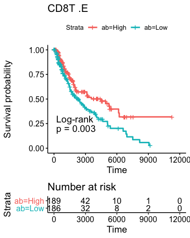<!-- -->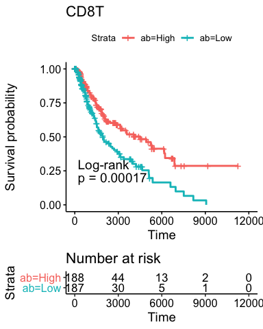<!-- -->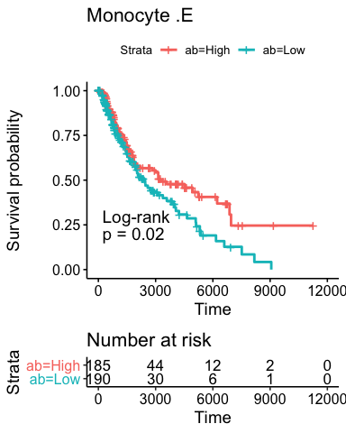<!-- -->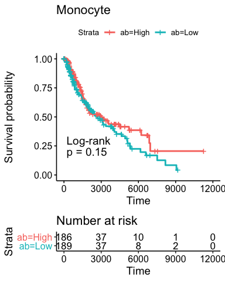<!-- --><!-- --><!-- --><!-- --><!-- --><!-- --><!-- -->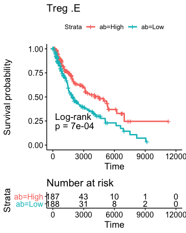<!-- --><!-- -->

Generate plots of survival curves with respect to **relative cell type fractions** for SKCM.


```r
ct = ctf[["SKCM"]]
cell_types = c("CD4T", "Monocyte", "B", "NK", "Neutrophil", "Treg")

glist = list()
for(ctype1 in cell_types){
  ctype1E = paste0(ctype1, ".E")
  ct.lrE  = log2(ct[[ctype1E]]/ct[["CD8T.E"]])
  rel.ab  = rep("Low", length(ct.lrE))
  rel.ab[which(ct.lrE > median(ct.lrE))] = "High"
  
  fit1 = survfit(Surv(DSS.time, DSS) ~ rel.ab, data=ct)
  g1 = ggsurvplot(fit1, data = ct, risk.table = TRUE, 
                  pval=TRUE, pval.method=TRUE, 
                  title=paste(ctype1, ".E"))
  
  ct.lr = log2(ct[[ctype1]]/ct[["CD8T"]])
  rel.ab = rep("Low", length(ct.lr))
  rel.ab[which(ct.lr > median(ct.lr))] = "High"

  fit2 = survfit(Surv(DSS.time, DSS) ~ rel.ab, data=ct)
  g2 = ggsurvplot(fit2, data = ct, risk.table = TRUE, 
                  pval=TRUE, pval.method=TRUE, 
                  title=ctype1)

  print(g1)
  print(g2)
}
```

<!-- -->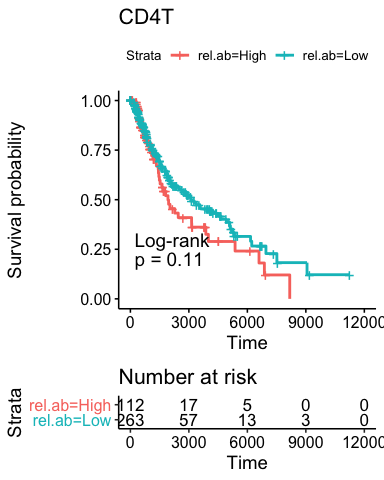<!-- --><!-- -->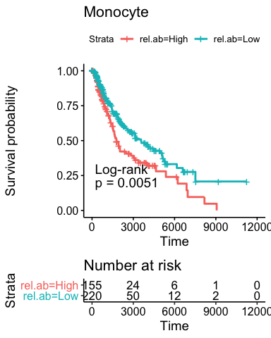<!-- -->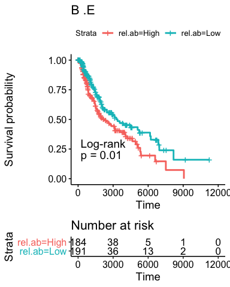<!-- -->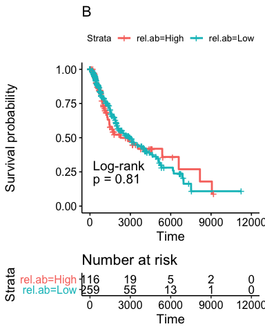<!-- --><!-- --><!-- -->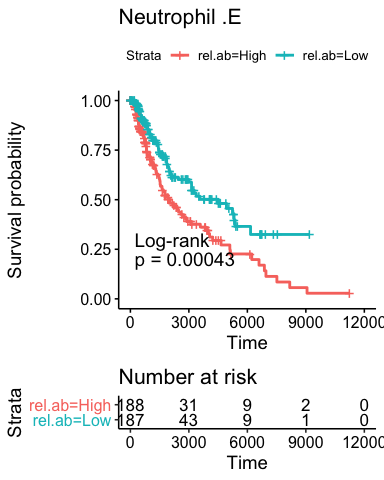<!-- -->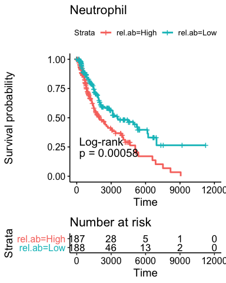<!-- --><!-- --><!-- -->

# Assess the associations between mutation load and cell type fractions

First load mutation burden data


```r
scL = list()
for(c1 in cancer_types){
  sc = readRDS(sprintf("TCGA_Results/clinical_data/%s_somatic_clinic.rds", c1))
  dim(sc)
  names(sc)
  
  sc = sc[,-(23:32)]
  dim(sc)
  sc[1:2,]
  
  names(sc)[1] = "bcr_patient_barcode"
  ct = ctf[[c1]]
  dim(ct)
  ct[1:2,]

  sc = merge(sc, ct, by="bcr_patient_barcode")
  dim(sc)
  sc[1:2,]

  scL[[c1]] = sc
}

lapply(ctf, dim)
```

```
## $COAD
## [1] 184  49
## 
## $LUAD
## [1] 414  49
## 
## $LUSC
## [1] 330  49
## 
## $SKCM
## [1] 393  49
```

```r
lapply(scL, dim)
```

```
## $COAD
## [1] 176  76
## 
## $LUAD
## [1] 376  76
## 
## $LUSC
## [1] 307  76
## 
## $SKCM
## [1] 359  76
```

Next assess the associations between mutation burden and cell type fractions 


```r
for(c1 in cancer_types){
  cat("\n--------------------------------------------------------------\n")
  cat(c1)
  cat("\n--------------------------------------------------------------\n")

  sc = scL[[c1]]
  mb1 = sc$raw_MB_hg38_SNV + sc$raw_MB_hg38_INDEL
  mb2 = sc$raw_MB_hg38_SNV*sc$prop_clonal + sc$raw_MB_hg38_INDEL
  mb  = cbind(mb1, mb2)
  mb[mb < 10] = NA
  mb = log10(mb)
  cf  = sc[,30:43]
  
  cr1 = cor(mb, cf, method="spearman", use="pairwise.complete.obs")
  pv1 = matrix(NA, nrow=2, ncol=14)
  
  for(j in 1:2){
    for(k in 1:14){
      cjk = cor.test(mb[,j], cf[,k], method="spearman")
      pv1[j,k] = cjk$p.value
    }
  }

  cp = cbind(round(t(cr1),3), signif(t(pv1),2))
  colnames(cp)[3:4] = c("mb1.pval", "mb2.pval")
  print(cp)

  crE = cr1[,1:7]
  colnames(crE) = gsub(".E", "", colnames(crE))
  gc1 = ggcorrplot(crE, lab = TRUE, title=paste0(c1, "-Expr"))
  
  gc2 = ggcorrplot(cr1[,8:14], lab = TRUE, title=paste0(c1, "-Meth"))
  
  gga = ggarrange(gc1, gc2 + rremove("legend"), ncol = 2, nrow = 1)
  print(gga)
}
```

```
## 
## --------------------------------------------------------------
## COAD
## --------------------------------------------------------------
##                 mb1    mb2 mb1.pval mb2.pval
## CD4T.E       -0.020 -0.057   0.7900   0.4600
## CD8T.E        0.213  0.192   0.0046   0.0110
## Monocyte.E   -0.069 -0.138   0.3600   0.0680
## B.E          -0.134 -0.189   0.0770   0.0120
## NK.E          0.215  0.199   0.0041   0.0081
## Neutrophil.E  0.089  0.104   0.2400   0.1700
## Treg.E       -0.031 -0.119   0.6800   0.1100
## CD4T         -0.139 -0.174   0.0660   0.0210
## CD8T          0.226  0.203   0.0026   0.0068
## Monocyte      0.006 -0.071   0.9400   0.3500
## B             0.009 -0.057   0.9100   0.4500
## NK            0.013 -0.012   0.8600   0.8700
## Neutrophil   -0.001 -0.010   0.9900   0.8900
## Treg         -0.154 -0.153   0.0410   0.0430
```

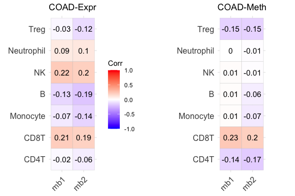<!-- -->

```
## 
## --------------------------------------------------------------
## LUAD
## --------------------------------------------------------------
##                 mb1    mb2 mb1.pval mb2.pval
## CD4T.E       -0.067 -0.055  2.0e-01  2.9e-01
## CD8T.E        0.230  0.200  6.8e-06  1.3e-04
## Monocyte.E   -0.124 -0.100  1.7e-02  5.6e-02
## B.E           0.018  0.000  7.3e-01  9.9e-01
## NK.E         -0.015 -0.009  7.7e-01  8.7e-01
## Neutrophil.E -0.074 -0.078  1.5e-01  1.4e-01
## Treg.E       -0.156 -0.131  2.5e-03  1.2e-02
## CD4T         -0.334 -0.266  3.4e-11  2.8e-07
## CD8T          0.162  0.136  1.6e-03  9.5e-03
## Monocyte      0.003  0.025  9.6e-01  6.4e-01
## B             0.026  0.008  6.1e-01  8.9e-01
## NK            0.067  0.054  1.9e-01  3.1e-01
## Neutrophil   -0.098 -0.118  5.9e-02  2.5e-02
## Treg         -0.155 -0.152  2.6e-03  3.8e-03
```

<!-- -->

```
## 
## --------------------------------------------------------------
## LUSC
## --------------------------------------------------------------
##                 mb1    mb2 mb1.pval mb2.pval
## CD4T.E       -0.175 -0.216  2.1e-03  1.5e-04
## CD8T.E       -0.127 -0.204  2.6e-02  3.4e-04
## Monocyte.E   -0.254 -0.234  6.6e-06  3.7e-05
## B.E          -0.125 -0.167  2.9e-02  3.6e-03
## NK.E          0.040  0.024  4.8e-01  6.7e-01
## Neutrophil.E -0.071 -0.053  2.2e-01  3.6e-01
## Treg.E       -0.149 -0.177  9.2e-03  2.0e-03
## CD4T          0.115  0.142  4.5e-02  1.3e-02
## CD8T         -0.171 -0.267  2.7e-03  2.3e-06
## Monocyte     -0.142 -0.119  1.3e-02  3.9e-02
## B            -0.188 -0.250  9.3e-04  1.1e-05
## NK           -0.115 -0.094  4.5e-02  1.0e-01
## Neutrophil   -0.071 -0.052  2.2e-01  3.7e-01
## Treg          0.170  0.202  2.9e-03  4.0e-04
```

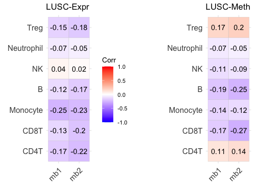<!-- -->

```
## 
## --------------------------------------------------------------
## SKCM
## --------------------------------------------------------------
##                 mb1    mb2 mb1.pval mb2.pval
## CD4T.E        0.038  0.013   0.4800    0.820
## CD8T.E        0.110  0.059   0.0390    0.270
## Monocyte.E   -0.004 -0.020   0.9500    0.710
## B.E           0.032  0.007   0.5500    0.900
## NK.E         -0.033 -0.005   0.5300    0.920
## Neutrophil.E -0.053 -0.001   0.3200    0.980
## Treg.E        0.031 -0.032   0.5600    0.560
## CD4T         -0.074 -0.069   0.1600    0.200
## CD8T          0.146  0.093   0.0059    0.085
## Monocyte      0.021  0.033   0.6900    0.540
## B             0.044  0.014   0.4100    0.790
## NK            0.089  0.116   0.0930    0.031
## Neutrophil   -0.056 -0.004   0.2900    0.940
## Treg         -0.091 -0.097   0.0860    0.072
```

<!-- -->

Illustrate cell type fraction estimates

```r
lapply(scL, dim)
```

```
## $COAD
## [1] 176  76
## 
## $LUAD
## [1] 376  76
## 
## $LUSC
## [1] 307  76
## 
## $SKCM
## [1] 359  76
```

```r
scDf = NULL
for(c1 in cancer_types){
  scDf = rbind(scDf, scL[[c1]])
}
dim(scDf)
```

```
## [1] 1218   76
```

```r
scDf[1:2,]
```

```
##   bcr_patient_barcode SMASH_S_hg38 SMASH_oE_hg38 SMASH_wE_hg38 SMASH_oNE_hg38
## 1        TCGA-A6-2671            3          1.06     0.9274599      0.5531430
## 2        TCGA-A6-2675            2          0.68     0.7213201      0.6600493
##   SMASH_wNE_hg38 AscatPurity AscatPloidy raw_MB_hg38_SNV raw_MB_hg38_INDEL
## 1      0.4846527        0.68    3.609337              49                 7
## 2      0.6585205        0.49    3.351309              72                 2
##   IDH_CNV_status_hg38 tCN_burden tCN_burden_ap tumor_type.x num_clonal
## 1       IDH wild type   2.228662     1.0712969         COAD         39
## 2       IDH wild type   1.572784     0.8041944         COAD         46
##   num_subclonal prop_clonal gender.x age tumor_type.y
## 1            10   0.7959184     MALE  85        Colon
## 2            26   0.6388889     MALE  78        Colon
##   initial_pathologic_diagnosis_method  histological_type.x
## 1                                <NA> Colon Adenocarcinoma
## 2                                <NA> Colon Adenocarcinoma
##   yr_of_tobacco_smoking_onset pathologic_T stage    Time Delta
## 1                        <NA>           T3    IV 1331.01     1
## 2                        <NA>           T3    II 1321.01     0
##   radiation_therapy patient_id     CD4T.E     CD8T.E Monocyte.E        B.E
## 1                NO       2671 0.07665117 0.03053652 0.07737681 0.01560974
## 2                NO       2675 0.12102204 0.04654293 0.16303034 0.13314210
##         NK.E Neutrophil.E     Treg.E       CD4T       CD8T   Monocyte
## 1 0.01773015   0.03318939 0.01890621 0.04401678 0.00500000 0.06109717
## 2 0.02475289   0.03814128 0.05336841 0.17399563 0.09486904 0.07275387
##            B         NK Neutrophil       Treg ...1 type
## 1 0.02888513 0.00500000 0.05312428 0.08287664 1961 COAD
## 2 0.06724810 0.03319116 0.03366724 0.10427496 1964 COAD
##   age_at_initial_pathologic_diagnosis gender.y  race
## 1                                  85     MALE WHITE
## 2                                  78     MALE WHITE
##   ajcc_pathologic_tumor_stage   clinical_stage  histological_type.y
## 1                    Stage IV [Not Applicable] Colon Adenocarcinoma
## 2                   Stage IIA [Not Applicable] Colon Adenocarcinoma
##   histological_grade initial_pathologic_dx_year menopause_status birth_days_to
## 1    [Not Available]                       2009  [Not Available]        -31329
## 2    [Not Available]                       2009  [Not Available]        -28813
##   vital_status tumor_status last_contact_days_to death_days_to  cause_of_death
## 1         Dead   WITH TUMOR                   NA          1331 [Not Available]
## 2        Alive   TUMOR FREE                 1321            NA [Not Available]
##   new_tumor_event_type new_tumor_event_site new_tumor_event_site_other
## 1                 <NA>                 <NA>                       <NA>
## 2                 <NA>                 <NA>                       <NA>
##   new_tumor_event_dx_days_to treatment_outcome_first_course margin_status
## 1                        535                [Not Available]          <NA>
## 2                         NA    Complete Remission/Response          <NA>
##   residual_tumor OS OS.time DSS DSS.time DFI DFI.time PFI PFI.time Redaction
## 1             NA  1    1331   1     1331  NA       NA   1      535      <NA>
## 2             NA  0    1321   0     1321   0     1321   0     1321      <NA>
```

```r
names(scDf)
```

```
##  [1] "bcr_patient_barcode"                 "SMASH_S_hg38"                       
##  [3] "SMASH_oE_hg38"                       "SMASH_wE_hg38"                      
##  [5] "SMASH_oNE_hg38"                      "SMASH_wNE_hg38"                     
##  [7] "AscatPurity"                         "AscatPloidy"                        
##  [9] "raw_MB_hg38_SNV"                     "raw_MB_hg38_INDEL"                  
## [11] "IDH_CNV_status_hg38"                 "tCN_burden"                         
## [13] "tCN_burden_ap"                       "tumor_type.x"                       
## [15] "num_clonal"                          "num_subclonal"                      
## [17] "prop_clonal"                         "gender.x"                           
## [19] "age"                                 "tumor_type.y"                       
## [21] "initial_pathologic_diagnosis_method" "histological_type.x"                
## [23] "yr_of_tobacco_smoking_onset"         "pathologic_T"                       
## [25] "stage"                               "Time"                               
## [27] "Delta"                               "radiation_therapy"                  
## [29] "patient_id"                          "CD4T.E"                             
## [31] "CD8T.E"                              "Monocyte.E"                         
## [33] "B.E"                                 "NK.E"                               
## [35] "Neutrophil.E"                        "Treg.E"                             
## [37] "CD4T"                                "CD8T"                               
## [39] "Monocyte"                            "B"                                  
## [41] "NK"                                  "Neutrophil"                         
## [43] "Treg"                                "...1"                               
## [45] "type"                                "age_at_initial_pathologic_diagnosis"
## [47] "gender.y"                            "race"                               
## [49] "ajcc_pathologic_tumor_stage"         "clinical_stage"                     
## [51] "histological_type.y"                 "histological_grade"                 
## [53] "initial_pathologic_dx_year"          "menopause_status"                   
## [55] "birth_days_to"                       "vital_status"                       
## [57] "tumor_status"                        "last_contact_days_to"               
## [59] "death_days_to"                       "cause_of_death"                     
## [61] "new_tumor_event_type"                "new_tumor_event_site"               
## [63] "new_tumor_event_site_other"          "new_tumor_event_dx_days_to"         
## [65] "treatment_outcome_first_course"      "margin_status"                      
## [67] "residual_tumor"                      "OS"                                 
## [69] "OS.time"                             "DSS"                                
## [71] "DSS.time"                            "DFI"                                
## [73] "DFI.time"                            "PFI"                                
## [75] "PFI.time"                            "Redaction"
```

```r
names(scDf)[14] = "cancer_type"

scE = scDf[,c(14,30:36)]
rhos = scE %>% pivot_longer(-cancer_type, names_to=c("cell_type"))

ggplot(rhos, aes(x=cell_type, y=value, fill=cancer_type)) +
  geom_boxplot() + labs(title="Cell type fraction by gene expression")
```

<!-- -->

```r
scM = scDf[,c(14,37:43)]
rhos = scM %>% pivot_longer(-cancer_type, names_to=c("cell_type"))

ggplot(rhos, aes(x=cell_type, y=value, fill=cancer_type)) +
  geom_boxplot() + labs(title="Cell type fraction by DNA methylation")
```

<!-- -->

Compare cell type fraction estimates between gene expression and DNA methylation

```r
cell_types = c("B", "CD4T", "CD8T", "Monocyte", "NK", "Neutrophil", "Treg")

for(cc1 in cell_types){
  g1 = ggplot(scDf, aes_string(x=paste0(cc1, ".E"), y=cc1, color="cancer_type")) + 
    geom_point() + geom_smooth(method=lm) + facet_grid(~ cancer_type) + 
    theme(legend.position = "none")
  print(g1)
}
```

<!-- -->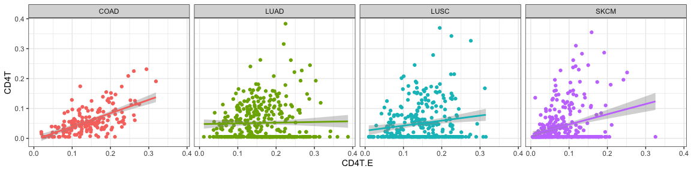<!-- --><!-- --><!-- --><!-- --><!-- -->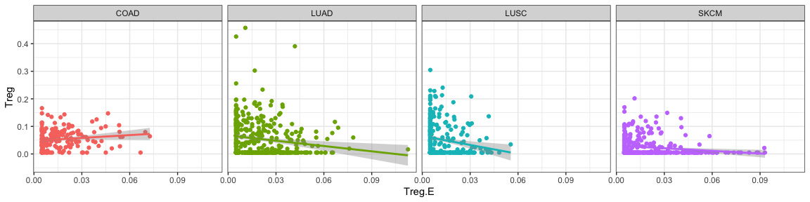<!-- -->

Compare cell type fraction estimates vs. mutation burden

```r
cell_types = c("B", "CD4T", "CD8T", "Monocyte", "NK", "Neutrophil", "Treg")
mb = scDf$raw_MB_hg38_SNV + scDf$raw_MB_hg38_INDEL
mb[which(mb < 10)] = NA
scDf$mb = log10(mb)

for(cc1 in cell_types){
  g1 = ggplot(scDf, aes_string(x="mb", y=paste0(cc1, ".E"), color="cancer_type")) + 
    geom_point() + geom_smooth(method=lm) + facet_grid(~ cancer_type) + 
    theme(legend.position = "none")
  print(g1)

  g1 = ggplot(scDf, aes_string(x="mb", y=cc1, color="cancer_type")) + 
    geom_point() + geom_smooth(method=lm) + facet_grid(~ cancer_type) + 
    theme(legend.position = "none")
  print(g1)
}
```

<!-- -->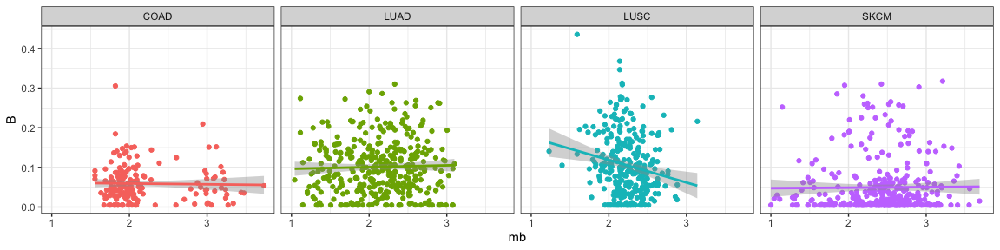<!-- --><!-- --><!-- -->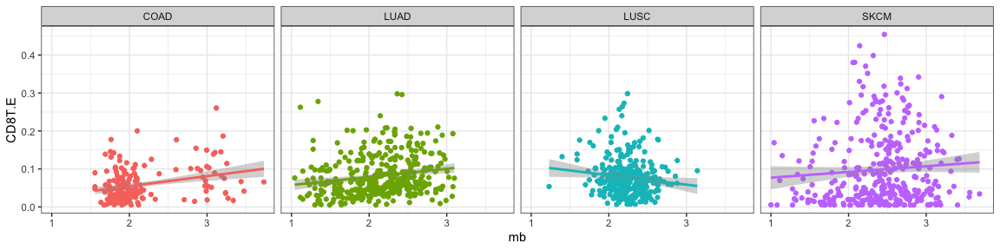<!-- --><!-- --><!-- --><!-- --><!-- -->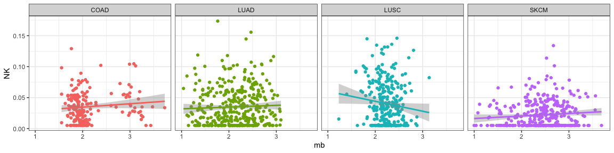<!-- -->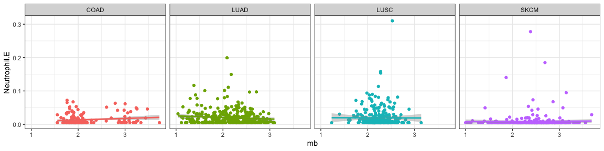<!-- -->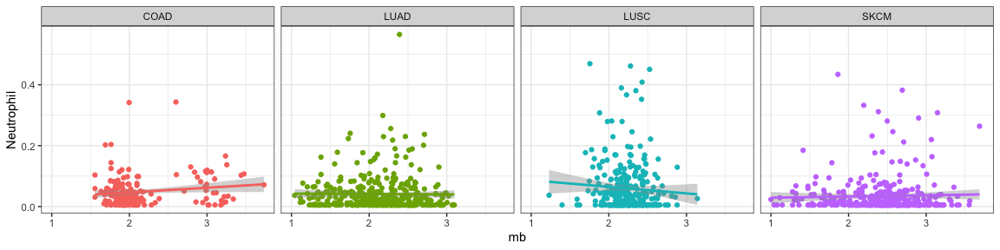<!-- --><!-- --><!-- -->

# Association between hypermutation status in COAD and immune cell fractions. 

First define the hypermutation subgroup with larger number of mutations. 


```r
coad = scL[["COAD"]]

ggplot(coad, aes(x=log10(raw_MB_hg38_SNV)))+
  geom_histogram(color="darkblue", fill="lightblue")  +
  geom_vline(xintercept = log10(400))
```

<!-- -->

```r
coad$hyper_mut = coad[,"raw_MB_hg38_SNV"] > 400
```

Next compare the cell type fractions between hypermuted and non-hypermutated groups. 

```r
ctypes = c("CD8T.E", "CD8T", "Treg.E", "Treg")
gl = list()
for(ct1 in ctypes){
  w1 = wilcox.test(coad[[ct1]]~ coad$hyper_mut)

  gl[[ct1]] = ggplot(coad, aes_string(x="hyper_mut", y=ct1, fill="hyper_mut")) + 
    theme(legend.position = "none") + geom_violin(trim=FALSE) + 
    geom_boxplot(width=0.1, fill="white") + 
    labs(title=sprintf("Wilcox p=%.1e", w1$p.value), x="Hypermutation status")
}

ggarrange(gl[[1]], gl[[2]], gl[[3]], gl[[4]], nrow = 2, ncol = 2)
```

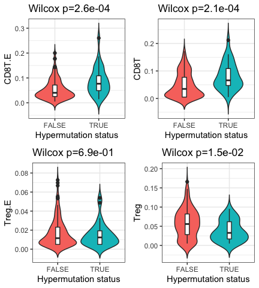<!-- -->


# Session information

```r
gc()
```

```
##           used  (Mb) gc trigger  (Mb) limit (Mb) max used  (Mb)
## Ncells 2278381 121.7    4315511 230.5         NA  4315511 230.5
## Vcells 4379686  33.5   10146329  77.5      32768  8734983  66.7
```

```r
sessionInfo()
```

```
## R version 3.6.2 (2019-12-12)
## Platform: x86_64-apple-darwin15.6.0 (64-bit)
## Running under: macOS Catalina 10.15.7
## 
## Matrix products: default
## BLAS:   /Library/Frameworks/R.framework/Versions/3.6/Resources/lib/libRblas.0.dylib
## LAPACK: /Library/Frameworks/R.framework/Versions/3.6/Resources/lib/libRlapack.dylib
## 
## locale:
## [1] en_US.UTF-8/en_US.UTF-8/en_US.UTF-8/C/en_US.UTF-8/en_US.UTF-8
## 
## attached base packages:
## [1] stats     graphics  grDevices utils     datasets  methods   base     
## 
## other attached packages:
##  [1] tidyr_1.0.2          ggcorrplot_0.1.3     stargazer_5.2.2     
##  [4] readxl_1.3.1         survminer_0.4.8      survival_3.1-8      
##  [7] ggpointdensity_0.1.0 ggpubr_0.4.0.999     ggplot2_3.3.1       
## [10] data.table_1.12.8   
## 
## loaded via a namespace (and not attached):
##  [1] Rcpp_1.0.3       lattice_0.20-38  zoo_1.8-7        utf8_1.1.4      
##  [5] assertthat_0.2.1 digest_0.6.23    plyr_1.8.5       R6_2.4.1        
##  [9] cellranger_1.1.0 backports_1.1.5  evaluate_0.14    pillar_1.4.3    
## [13] rlang_0.4.6      curl_4.3         car_3.0-8        Matrix_1.2-18   
## [17] rmarkdown_2.1    labeling_0.3     splines_3.6.2    stringr_1.4.0   
## [21] foreign_0.8-75   munsell_0.5.0    broom_0.5.6      compiler_3.6.2  
## [25] xfun_0.12        pkgconfig_2.0.3  mgcv_1.8-31      htmltools_0.4.0 
## [29] tidyselect_1.0.0 tibble_3.0.1     gridExtra_2.3    km.ci_0.5-2     
## [33] rio_0.5.16       fansi_0.4.1      crayon_1.3.4     dplyr_0.8.4     
## [37] withr_2.1.2      grid_3.6.2       nlme_3.1-144     xtable_1.8-4    
## [41] gtable_0.3.0     lifecycle_0.2.0  magrittr_1.5     KMsurv_0.1-5    
## [45] scales_1.1.0     zip_2.0.4        cli_2.0.1        stringi_1.4.5   
## [49] carData_3.0-4    reshape2_1.4.3   farver_2.0.3     ggsignif_0.6.0  
## [53] ellipsis_0.3.0   survMisc_0.5.5   generics_0.0.2   vctrs_0.3.0     
## [57] cowplot_1.0.0    openxlsx_4.1.5   tools_3.6.2      forcats_0.5.0   
## [61] glue_1.3.1       purrr_0.3.3      hms_0.5.3        abind_1.4-5     
## [65] yaml_2.2.1       colorspace_1.4-1 rstatix_0.6.0    knitr_1.28      
## [69] haven_2.3.0
```
